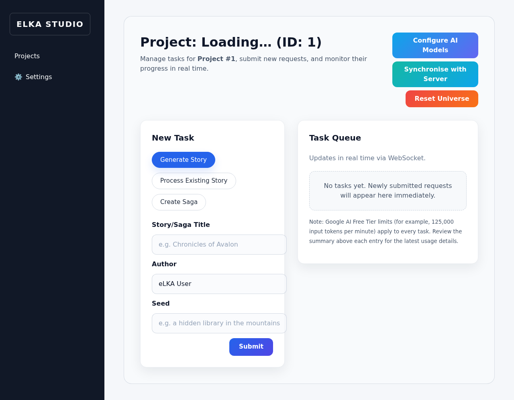

# eLKA Studio

eLKA Studio is a full-stack application for building and managing fictional universes. It combines a FastAPI backend, a Celery-powered task pipeline, and a React/Vite frontend to deliver a cohesive world-building experience.


## Features
- **Project management dashboard** – Create, organize, and synchronize projects across local and remote Git repositories.
- **Real-time task queue** – Monitor Celery jobs through Redis-backed WebSockets for immediate progress updates.
- **Hierarchical task explorer** – Review parent and child jobs together, including saga plans and generated chapter stories directly within the dashboard.
- **Persistent saga context** – Backend workers now write saga outlines, chapter prose, and Universe Consistency Engine file manifests straight into task records for immediate UI previews.
- **Inline story previews** – Open generated stories and processed files directly from the task queue without leaving the dashboard.
- **Collapsible task controls** – Submit saga, story, and processing jobs from grouped, collapsible forms with expanded saga theme inputs.
- **Story & saga generation** – Launch AI-assisted generation pipelines for single stories or multi-chapter sagas.
- **Automated lore processing** – Validate, archive, and version generated content with Git integration.
- **Approval-based Git commits** – Tasks stage their files and, once approved, push directly to the project's default branch without manual PR juggling.
- **Universe reset tooling** – Instantly wipe lore files and restore the default scaffold to start fresh tests or story arcs.
- **Full-context story pipeline** – A single task loads the entire universe, generates consistent lore, archives entities, and updates the timeline automatically.
- **Manual story processing** – Submit existing stories for validation, extraction, and archival directly from the dashboard.
- **Bulk story import** – Upload existing Markdown or text files in one batch and queue the Universe Consistency Engine for sequential processing that now continues even when individual stories resolve as no-ops or dry-runs.
- **Universe browser** – Explore repository directories and preview Markdown or text files through a dedicated read-only viewer.
- **Text-to-speech previews** – Listen to Universe Browser file contents using integrated Web Speech controls.
- **Objects entity archival** – Persist extracted characters, locations, and events into `.txt` files inside the `Objects/` structure used by AI Universe projects.
- **Story metadata front matter** – Generated manuscripts now begin with YAML metadata containing the title, author, originating seed, and UTC timestamp for downstream tooling.
- **Universe Consistency Engine** – Extract facts, verify canon conflicts, and propose Git-ready updates.
- **Extensible architecture** – Modular backend services and a modern React frontend designed for customization.
- **Token transparency** – Track estimated universe context size and per-task token consumption to manage Gemini quotas.
- **Per-project AI model overrides** – Configure extraction, validation, generation, and planning models for each project with automatic fallbacks to the global configuration.
- **Hard-sync Git controls** – Keep the working tree aligned with the remote default branch through automatic pre-task synchronisation and a dedicated dashboard button.

## Architecture

eLKA Studio combines a FastAPI backend, a Celery worker layer, and a React/Vite frontend. Redis brokers real-time task updates, while Git integration keeps universe repositories synchronized across automated pipelines and manual workflows.

## Universe Data Format

eLKA Studio now parses entity YAML Front Matter with [python-frontmatter](https://github.com/eyeseast/python-frontmatter), so entity files can live in nested `Entities/` subdirectories as long as their metadata remains valid.

eLKA Studio uses a standardized format for storing universe data within Git repositories. This format utilizes Markdown files with YAML Front Matter for structured metadata.

For the detailed specification, please see the [**eLKA Universe Data Standard (UNIVERSE_FORMAT.md)**](UNIVERSE_FORMAT.md).

## Quick Start
1. Clone the repository: `git clone <repo-url> && cd elka-studio`
2. Install everything with `make setup` (see `scripts/install.sh` for details).
   The installer verifies required system packages (Python, npm, Redis, etc.) and will attempt to install any missing dependencies automatically. Be ready to enter your administrator password if prompted. Python form uploads rely on [`python-multipart`](https://github.com/Kludex/python-multipart), which is now included in both the backend and root requirements so Celery and FastAPI can load routes that accept `multipart/form-data` payloads (such as the bulk story importer) without runtime errors.
3. Create `config.yml` (copy `config.yml.example`) and update the `security.secret_key` value. Use the suggested `SECRET_KEY` printed by the installer or generate your own random string.
4. Launch the stack with `make run-dev`. The command starts the FastAPI server, Celery worker, Redis, and the Vite frontend on [http://localhost:5173](http://localhost:5173).
5. Need only the backend APIs? Run `make run-backend` to skip the frontend server.
6. The UI is automatically available at [http://localhost:5173](http://localhost:5173).
7. On first launch, open the **Settings** page (gear icon) in the left navigation pane, store your Gemini API key, and pick the default AI adapter (Gemini or the offline heuristic). The key is saved securely in your browser (localStorage) and adapter changes persist to `config.yml`.
8. Return to the **Projects** page and click **Add/Import Project**—the same dialog now supports both initializing a new universe and connecting to an existing lore repository. The form accepts either the shorthand `user/project` or a full Git URL. If the import fails, the dialog shows the error message together with the HTTP status code, and the backend logs the full traceback so you can diagnose the issue directly from the terminal.

## Continuous Integration

All changes pushed to or proposed against the `main` branch trigger the **Backend CI** workflow defined in `.github/workflows/backend-ci.yml`. The pipeline installs the backend dependencies, enforces the Ruff formatter and linter, and executes the backend test-suite via `pytest elka-studio/backend/tests/`. Run the same commands locally before opening a pull request to match the automation and keep the branch history green.

## Configuration
- The backend CORS policy is loaded from `config.yml` (section `cors.allow_origins`). The defaults allow the development frontend at `http://127.0.0.1:5173` and `http://localhost:5173`. If you need more domains, add them to the list or set the `ELKA_ALLOWED_ORIGINS` environment variable with comma-separated URLs. The CORS middleware initializes before routers are registered, so both the backend and Celery worker modules load without `NameError` exceptions.
- The `security.secret_key` section in `config.yml` replaces the need for the `SECRET_KEY` environment variable. The backend and Celery worker automatically read the value from configuration and use it when encrypting stored Git tokens. If you still define the environment variable, it takes precedence over the configuration value.
- `config.yml` also supports the `git`, `ai`, `tasks`, and `stories` sections. They control the default Git branch (`git.default_branch`), the model name recorded in generated story metadata (`ai.model`), per-pipeline model routing (`tasks.*.model`), and archival rules (`stories.directory`, `stories.extension`, `stories.timestamp_format`). Use `tasks.seed_generation.model` to dedicate a model to seed-based story generation; when the field is omitted the worker falls back to the general `tasks.generation.model` entry. Saga chapters can be tuned through `tasks.generate_chapter.model`. The `ai.models` section defines aliases (`gemini-pro`, `gemini-flash`) and default models of the current generation (`gemini-2.5`). If the file is missing, the application falls back to safe defaults automatically.
- `ai.default_adapter` lets you persist the active adapter (`gemini` or `heuristic`). The Settings UI now updates this field through a dedicated API and reminds you to restart the backend when switching providers.
- Gemini rate limits can be tuned through `ai.adapters.gemini.rate_limit_rpm` in `config.yml` or the `GEMINI_RATE_LIMIT_RPM` environment variable. Workers proactively throttle Gemini calls to stay within free-tier quotas and automatically retry tasks (generation, JSON helpers, and validator analysis) when Google responds with HTTP 429 (ResourceExhausted). The adapter now interprets the Gemini SDK's `ClientError` payloads, honours the `RetryInfo.retryDelay` hint before scheduling Celery retries, explicitly re-raises Celery `Retry` exceptions before the generic handlers log unexpected failures, and counts tokens via the official `models.count_tokens` endpoint—resolving the `Models.get()` argument error introduced by recent SDK updates.

## AI Providers
- The backend uses a deterministic **heuristic** adapter if no API key is configured. As soon as you define `GEMINI_API_KEY`, two clients become available:
  - `AI_VALIDATOR_MODEL` (default `gemini-2.5-pro`) analyzes and verifies story consistency.
  - `AI_WRITER_MODEL` (default `gemini-2.5-flash`) generates Markdown source material for timelines, entities, and summaries.
- In `config.yml` you can optionally store `ai.gemini_api_key`, `ai.validator_model`, `ai.writer_model`, and aliases in `ai.models`. Environment variables always take precedence and prevent accidentally logging secrets.
- If the API key is missing or the provider is set to `heuristic`, the system switches to the deterministic strategy and stays compatible with existing projects.
- The validator now tolerates free-form responses coming from external AI providers. When a model returns plain text instead of structured JSON, the worker records the message and infers the pass/fail status, keeping the pipeline resilient even if the provider format drifts.
- Quick environment and configuration setup:
  ```bash
  export GEMINI_API_KEY="your-secret"

  # config.yml
  ai:
    provider: "gemini"
    models:
      gemini-pro: "gemini-2.5-pro"
      gemini-flash: "gemini-2.5-flash"
    validator_model: "gemini-2.5-pro"
    writer_model: "gemini-2.5-flash"
  ```
- The API documentation (`/docs`) now highlights that validation uses Gemini 2.5 Pro and content generation uses Gemini 2.5 Flash when those models are active.

## Universe Consistency Engine workflow

### Quickstart

1. **Configuration** – Copy `config.yml.example` and at minimum fill in the `security.secret_key` section. Activate Gemini through `ai.provider: "gemini"` and set the models:

   ```yaml
   ai:
     provider: "gemini"
     models:
       gemini-pro: "gemini-2.5-pro"
       gemini-flash: "gemini-2.5-flash"
     validator_model: "gemini-2.5-pro"
     writer_model: "gemini-2.5-flash"
   ```

2. **Environment variables** – Create a `.env` file (loaded by `make run-dev`), for example:

   ```dotenv
   GEMINI_API_KEY=your-secret
   AI_PROVIDER=gemini
   AI_VALIDATOR_MODEL=gemini-2.5-pro
   AI_WRITER_MODEL=gemini-2.5-flash
   ```

3. **Run the services** – In one terminal start the backend and Celery with `make run-backend`, and in another run `make run-worker`. The frontend (`make run-frontend`) is optional; backend + worker are enough to test the API.

4. **DRY-RUN** – Submit a story without applying changes:

   ```bash
   curl -X POST http://localhost:8000/api/tasks/story/process \
     -H "Content-Type: application/json" \
     -d '{"project_id": 1, "story_text": "Legend of the Spring Battle"}'
   ```

   The response `{ "task_id": ..., "celery_task_id": ... }` references a record in the database. After the task completes, `result.diff_preview` contains the full unified diff and file list without modifying the repository.

5. **APPLY** – Run the same story with `apply: true`:

   ```bash
   curl -X POST http://localhost:8000/api/tasks/story/process \
     -H "Content-Type: application/json" \
     -d '{"project_id": 1, "story_text": "Legend of the Spring Battle", "apply": true}'
   ```

   The worker writes the proposed files to disk and records them in `result.files` together with the recommended commit message. No Git push happens yet—the task stops at **SUCCESS** while waiting for explicit approval. Call `POST /api/tasks/{task_id}/approve` to apply the stored changes to the project’s default branch.

6. **Idempotence** – Re-running the same story returns `notes: ["no-op: universe already up-to-date"]` and an empty diff, because the timeline and entity data are normalized deterministically (for example, seasons map to quarters and duplicates are recognized by their normalized data key).

### Additional information

- `POST /api/tasks/story/process` accepts `{ project_id, story_text, apply? }`. The default **DRY-RUN** mode always stores the diff in the task record.
- The legends (`Legends/*.md`) and the template `templates/universe_scaffold/Legends/CORE_TRUTHS.md` are automatically loaded during validation.
- Validation and entity extraction now reuse the in-memory universe context string directly, ensuring the Gemini validator and extractor stay aware of the complete lore set without relying on file-path hints.
- Extractor retries now log raw provider responses when JSON decoding fails and detect incomplete payloads, helping diagnose upstream format issues quickly.
- The planner reconciles entities primarily by their stable IDs and only calls the AI matcher for ambiguous cases, reducing the risk of duplicate records when stories are reprocessed.
- If Gemini is unavailable, the heuristic adapter keeps the workflow running—the resulting diffs and Git commits remain deterministic.
- Quick local test: run `pytest elka-studio/backend/tests/test_uce_pipeline.py` to confirm the full **DRY-RUN → APPLY → NO-OP** flow against a temporary Git repository.

## API Notes
- When creating projects programmatically, send `name`, `git_url`, and (optionally) `git_token` in the request body to `/api/projects`. The API normalizes the GitHub shorthand `owner/repo` into a full URL and returns human-readable errors for invalid inputs.
- The backend root endpoint (`/api/`) returns a short status payload confirming the API is reachable and linking to the interactive documentation at `/docs`.
- Existing clients should be updated to use the new field names to avoid validation errors.
- The `/api/tasks` endpoint normalizes incoming task parameter keys to snake_case (for example `storyTitle` → `story_title`) before dispatching Celery workers, so custom integrations should prefer the canonical snake_case names to avoid ambiguity.
- Story generation requests must provide `params.seed` when calling `POST /api/tasks/` with the task type `generate_story`. The backend automatically chains the follow-up processing task, and the dashboard form handles the payload. Custom integrations should mirror the same structure to avoid validation errors.
- Existing stories can be submitted through `POST /api/tasks/` with `type="process_story"` and `params.story_content`. The worker reuses the same validation and archival pipeline used for generated narratives.
- The Universe Consistency Engine is available through `POST /api/tasks/story/process` with `project_id`, `story_text`, and an optional `apply` flag. Dry-run responses report the planned diff; the apply mode prepares the file payload and waits for approval before committing to the default branch.
- Approve task results with `POST /api/tasks/{task_id}/approve`. The endpoint sets `result_approved = true`, commits the recorded files to the main branch (for example `main`), and returns the resulting SHA in `result.commit_sha`.
- Reset a universe instantly through `POST /api/projects/{project_id}/reset`. The backend deletes lore directories (Stories/Legends/Objects) and timeline files, purges all related tasks from the queue history, commits the wipe, and reinstalls the default scaffold before force-pushing the scaffold back to the remote default branch.
- Force-refresh a repository with `POST /api/projects/{project_id}/sync`. The endpoint performs `git fetch` followed by `git reset --hard origin/<default_branch>` (including credential helper support) and powers the dashboard's **Synchronise with Server** button. Task submissions call the same routine before enqueuing work, so saga and story jobs always start from the latest remote state and recompute token estimates against fresh lore.
- Import existing stories in bulk with `POST /api/projects/{project_id}/import-stories`. Send a `multipart/form-data` payload with one or more `files` fields (`.txt` or `.md`), and the backend stores them under `Stories/Imported_<timestamp>/` before dispatching the Universe Consistency Engine sequentially across the uploaded files.
- Browse repository contents with `GET /api/projects/{project_id}/universe-files`, which performs a hard sync before returning a tree of folders and files (excluding `.git`). Pair it with `GET /api/projects/{project_id}/file-content?path=…` to read UTF-8 files safely through the UI.
- When a project stores an encrypted Git token, Celery tasks decrypt it and use a credential helper during `git push`, preventing repeated interactive GitHub login prompts during story processing or saga generation.
- Celery workers share a singleton application context (`backend/app/core/context.py`) that bootstraps configuration, AI adapters, Git helpers, and validation/archival services once per worker. Task payloads must include the `project_id` (and optionally `pr_id`) so the worker can retrieve the correct repository without reinitializing the FastAPI stack for every job.

## Testing the Universe Consistency Engine
- Run `pytest elka-studio/backend/tests/test_uce_core.py` to execute deterministic unit tests covering fact extraction, universe loading, planner no-op detection, and Git application helpers.
- The fact extractor now retries malformed JSON payloads and slugifies entity identifiers deterministically, ensuring local runs mirror CI expectations when adapters drift from the documented schema.
- The suite provisions temporary Git repositories to simulate dry-run and apply flows, confirming that repeated runs emit explicit "no changes" notes instead of silently exiting.

## Testing task status updates
- Run `pytest elka-studio/backend/tests/test_tasks_api.py` to verify that pausing a task updates the database record and broadcasts a notification through the shared `TaskManager` instance without raising errors.

## Project Structure
- `backend/` – FastAPI application, Celery configuration, and Python business logic.
- `frontend/` – React + Vite single-page application for interacting with eLKA Studio.
- `scripts/` – Automation helpers for installation, updates, and development workflows.
- `Makefile` – Unified entry point for setup, development, and maintenance tasks.

## Updating the Project
Run `bash scripts/update.sh` (or `make setup` again) to pull the latest code and refresh dependencies. The update script performs the same dependency checks as the installer, ensuring tools such as Redis and npm stay available. Keep your virtual environment active when working on the backend.

## Troubleshooting
- **Redis connection errors**: Ensure Redis is available locally or via Docker. Use `make stop` to clean up the development container.
- **Backend fails to start**: Confirm that `backend/venv` exists and that `config.yml` contains valid values (especially `security.secret_key`). If the virtual environment becomes corrupted or is missing activation scripts, rerun `make setup` so the installer can recreate it automatically.
- **Legacy SQLite schema**: Older installations might miss recently added columns (for example `tasks.parent_task_id`, `tasks.saga_plan`, `tasks.story_content`). The backend now inspects the database on startup and adds any missing nullable columns automatically. Restart the server after pulling new code to let the synchronisation run; no manual migration is required for default setups.
- **Credential helper path issues**: When running the backend from directories containing spaces, ensure you pull the latest build. The Git helpers now wrap the credential helper path in quotes so that `git clone` and `git push` succeed regardless of workspace naming.
- **Failed universe reset with `GIT_CONFIG_PARAMETERS`**: Earlier builds surfaced `error: bogus format in GIT_CONFIG_PARAMETERS` when the dashboard's **Reset Universe** action pushed the scaffold. The backend now relies on `GIT_CREDENTIAL_HELPER`, eliminating the misformatted environment override. Update to the latest version if you still encounter this message.
- **ModuleNotFoundError during `make run-dev`**: The helper script now checks for critical backend modules (such as `limits`) and reinstalls `backend/requirements.txt` automatically if they are missing. If errors persist, remove `backend/venv` and run `make setup` to recreate the environment from scratch.
- **Node dependencies missing**: Re-run `npm install` inside the `frontend/` directory or execute `make setup`.
- **Celery saga commits fail with `imeline.md`**: Earlier builds trimmed the first
  character of `timeline.md` when staging Git changes, causing saga generation to
  abort with `No such file or directory`. Update to this release (or manually
  apply commit `fix: handle whitespace when reading git status`) so the worker
  correctly recognises new timeline files.
- **Saga generation task fails with `NameError: name 'writer_ai' is not defined`**: Ensure the backend is up to date. The worker now initialises the writer adapter before invoking the saga planner, so rerunning the task after pulling the latest backend code resolves the error without manual patches.

## Stage 3 acceptance checklist
- **Configuration** – Verify that `GEMINI_API_KEY`, `AI_PROVIDER`, `AI_VALIDATOR_MODEL`, and `AI_WRITER_MODEL` are present either in the environment or `config.yml`; see the snippets above for reference values.
- **Changed files** – Run `git status --short` or `git diff --stat` to review updates across adapters, configuration helpers, Celery tasks, and documentation.
- **Quick test** – Execute `pytest elka-studio/backend/tests/test_uce_core.py::test_plan_changes_uses_writer_for_body` to confirm the writer adapter routes to Gemini Flash, or run the full suite with `pytest`.
- **Commit message** – Use a Conventional Commits prefix such as `feat: integrate gemini adapters for lore workflows` when recording work on the feature branch.

Happy world-building!
